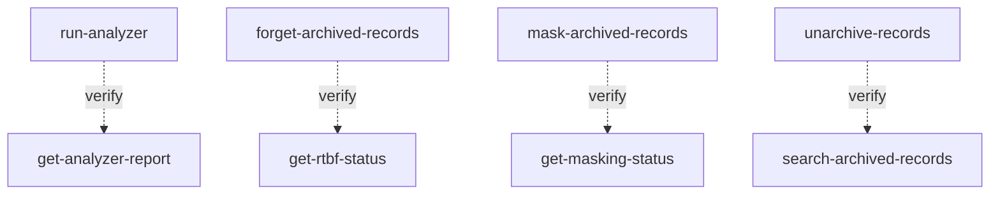

# Salesforce Archive Connect API — Operations Reference

All operations are under the base path `/platform/data-resilience/archive/`. Contracts verified live against archived data. Read the operation you need before constructing the call — several contracts are non-obvious.

## Operations Summary

| Operation | Purpose | Method + Path | Verify with |
|-----------|---------|---------------|-------------|
| `search-archived-records` | read | `POST /search` | — |
| `search-archived-records-with-sharing-rules` | read (Agentforce) | `POST /search/with-sharing-rules` | — |
| `get-search-archived-records-next-page` | read | `GET /search/next/{scrollId}` | — |
| `run-analyzer` | write | `POST /analyzer/run` | `get-analyzer-report` |
| `get-analyzer-report` | read | `GET /analyzer/report` | — |
| `unarchive-records` | write | `POST /unarchive` | re-run `search-archived-records` |
| `forget-archived-records` (RTBF) | write | `POST /rtbf` | `get-rtbf-status` |
| `get-rtbf-status` | read | `GET /rtbf/{requestId}` | — |
| `mask-archived-records` | write | `POST /mask` | `get-masking-status` |
| `get-masking-status` | read | `GET /mask/{requestId}` | — |
| `get-execution-details-stream-url` | read | `GET /log/execution-details-stream-url` | — |
| `get-failed-records-stream-url` | read | `GET /log/failed-records-stream-url` | — |
| `get-archive-storage-used` | read | `GET /storage/archive-used` | — |

**Deprecated — do not use** (no successor; currently 500): `global-search-by-id`, `get-global-search-results`, `view-archived-records`. Use `search-archived-records` (+ `get-search-archived-records-next-page`) for all archived-record lookups.

### Verify-after-write dependencies

---

## search-archived-records (`POST /search`)

Search archived records by object, filters, date ranges, and sort.

**Required**: `sobjectName` + at least 1 filter. Missing them returns a clean envelope validation error (`statusCode 400`).

**Inputs**:
- `sobjectName` *(string)* — API name of the sObject to search.
- `filters` *(array)* — Filter conditions, each `{field, value}` where **both are required strings**. `value` is a single string — **not** an array, **not** nullable (null/omitted → `400 "This field may not be null"`). There is **no `operator` field**. **At least 1, up to 6 filters, combined with AND only** (OR is not supported). Example: `[{"field":"Subject","value":"Foo"}]`.
- `dateRanges` *(array)* — Primary date filter: array of `{field, from, to}`. `from`/`to` must be full ISO-8601 datetime (`"2020-01-01T00:00:00Z"`); date-only → `400 JSON_PARSER_ERROR` (xsd:dateTime). Use the special field `archive_date` to filter by archive date instead of `CreatedDate`/`ModifiedDate`.
- `dateRange` *(object)* — Optional **singular** convenience range `{field, from, to}`; the controller folds it into `dateRanges` (one-element equivalent). Same singular shape that `unarchive-records` uses.
- `fields` *(array)* — Field API names to return.
- `pageSize` *(integer)* — Records per page; default 25, max 1000.
- `sortDirection` *(string)* — `asc`/`desc`, case-insensitive, default `asc`; an invalid value → 400.

**Output**: HTTP **201**, `body = { records[], total_result_count, scroll_id }`, `body.statusCode = 200`, `errorMessage` null on success. **Branch on `body.statusCode`, not the HTTP code** — once past framework validation the response is always 200/201 even on logical failure, with the error in `errorMessage` + `statusCode`.

**Excluded objects**: `Feed`, `History`, `Relation`, `Share` are not searchable; Files/Attachments are not retrievable.

### Pagination

Read records inline from each response. If `body.scroll_id != "-1"`, call `get-search-archived-records-next-page` with that `scroll_id`. **STOP when `scroll_id == "-1"`** — calling next-page with `"-1"` (the terminal sentinel) → 500. There is no separate fetch-by-requestId step.

## get-search-archived-records-next-page (`GET /search/next/{scrollId}`)

**Input**: `scrollId` *(string, path param)* — the `body.scroll_id` from a prior search. Stop when it is `"-1"`; never call with `"-1"`.
**Output**: `body` (next page), `errorMessage`, `statusCode` — same envelope as search.

---

## search-archived-records-with-sharing-rules (`POST /search/with-sharing-rules`)

Archive search **optimized for Agentforce agents**. (There is no `/search/related` endpoint — this is the operation that takes the JSON filter map.) Gated by the **`ViewArchivedRecords`** user permission (unlike plain `search-archived-records`, which uses `ViewSearchPage`).

**Required**: `objectName`, `filtersJson`.

**Inputs**:
- `objectName` *(string)* — API name of the sObject.
- `filtersJson` *(string)* — JSON-encoded **OBJECT MAP** of `fieldName → value`, e.g. `"{\"Subject\":\"Foo\",\"Status\":\"New\"}"`. **NOT** an array of `{field,value}` objects — the array form is rejected with `isSuccess:false "No valid filters provided. Please provide filtersJson"`.
- `dateField` *(string)* — API name of the date field for temporal filtering.
- `startDate` / `endDate` *(string)* — search window bounds (ISO-8601).
- `maxResults` *(integer)* — max records to return; default 100.

**Output**: `isSuccess` *(boolean — **branch on THIS, not the HTTP status**)*, `totalResultCount`, `records` (rich-text summary of ~5 key fields per record), `recordsJson` (HTML-entity-encoded JSON string), `errorMessage`, `message`, `warnings` (schema-validation/auto-fix advisories). **Validation failures surface as HTTP 201 + `isSuccess:false` + `errorMessage`, never a 4xx.** Pattern: `isSuccess:false` + `errorMessage` → caller bug; `isSuccess:true` + `recordsJson` → success.

---

## run-analyzer (`POST /analyzer/run`) + get-analyzer-report (`GET /analyzer/report`)

`run-analyzer` triggers the analyzer; HTTP 201, output `message` *(string, human-readable status)*. **`isRunning` is ALWAYS `null`** — the controller only populates `message`; never branch on `isRunning`. Poll `get-analyzer-report` to confirm completion. Non-destructive / idempotent.

`get-analyzer-report` returns `body` with: `topRecords[]` (`{objectName, objectLabel, objectIcon, size, count, usagePercent}` per archivable sObject), `topFiles[]` (parallel shape for files), `fileGeneralStorage`/`dataGeneralStorage` (`{storageUsed, storageRemaining, usagePercent}`), and `createdDateReport` (`"DD/MM/YYYY HH:MM:SS"`).

---

## unarchive-records (`POST /unarchive`)

Restore archived records back into live storage by criteria.

**Inputs**:
- `sobjectName` *(string)* — sObject whose records to unarchive.
- `filters` *(array)* — criteria identifying which archived records to restore.
- `dateRange` *(object)* — optional **SINGULAR** range `{field, from, to}` (reads `getDateRange()`, unlike `/search` which uses plural `dateRanges`); full ISO-8601 datetimes. Omit to unarchive by filters alone.

**Caps**: ≤1000 matched records (else not processed); ≤50 unarchive requests/hour/org. Restores the **whole archived hierarchy** of each match. Requires the **`UnarchiveSdk`** user permission (on top of org-level Archive enablement).

**Output**: `body` (unarchive job details incl. job id), `errorMessage`, `statusCode`. **Verify** by re-running `search-archived-records`. **Rollback**: re-archive via a new archive job with the same criteria.

---

## forget-archived-records / RTBF (`POST /rtbf`) + get-rtbf-status (`GET /rtbf/{requestId}`)

Submits a Right-To-Be-Forgotten erasure request.

**Input**: `criteria` *(array of `{sobject, field, value}`)* — ≤10 items, **one per object type**; ≤10,000 root records erased per org/day; field/object names case-insensitive. Deletes the **entire archived hierarchy** of each match (no partial deletion). Note: the criterion must match a record archived **as a root** — filtering a parent (e.g. Account by Id) when only its children were archived matches nothing.

**Output**: HTTP 201, `body.request_id` *(UUID)*. Poll `get-rtbf-status` (path param `requestId` = that UUID) → `body.status` (e.g. `"Request is open. Scan is still in progress"`). **Rollback**: none — RTBF erasure is permanent.

---

## mask-archived-records (`POST /mask`) + get-masking-status (`GET /mask/{requestId}`)

Submits a PII-masking (anonymization) request — irreversibly replaces detected PII values with placeholders (e.g. `redacted@example.com`) while keeping the record + non-PII fields searchable.

**Input**: `criteria` *(array of `{sobject, field, value}`)* — same shape as RTBF.

**Behavior**: permanent; one-time per record (re-requests on an already-masked record are ignored); shares the 10,000/day RTBF rate limit; **PII fields are auto-detected** (you cannot choose them); records under legal hold / retention lock are excluded; cascades to child records. Available **only via this API** (not in the Archive UI).

**Permission**: gated by the **`Rtbf`** user permission — the SAME permission as RTBF (`maskArchivedRecords` runs the RTBF access check), not a separate masking entitlement.

**Output**: HTTP 201, `body.request_id` *(UUID)*. Poll `get-masking-status` (path param `requestId`); status reaches **HANDLED** when complete. **Rollback**: none — anonymization is permanent.

---

## Log Downloads — get-execution-details-stream-url / get-failed-records-stream-url

Both are `GET /log/...` and mint a one-time presigned download URL. `get-execution-details-stream-url` → the execution-detail log; `get-failed-records-stream-url` → the failed-records log (records that did not process). Identical contract.

**Output**: `{ url }`. **`url != null` is success; `url: null` means no log was resolved** (missing/incorrect `requestId`/`reportType`, or the activity produced no such log) — always check `url != null`; never treat `url:null` or the 201 status alone as success.

**Required inputs**:
- `requestId` *(string)* — the **`ArchiveActivity` Id** (`8qv…` key) of a completed, log-producing job present in the archiver backend — **not** a search requestId. A missing/non-matching id → `url:null`.
- `reportType` *(string)* — that activity's `Type`: `Archive | Unarchive | Analyzer | Purge | Export-to-external-bucket | Export-and-download`. Omitting it → `url:null`.
- `sobjectName` *(string, optional)* — the backend self-resolves it.

This is the bridge between `ArchiveActivity` (see `archive-activity-entity.md`) and downloadable logs.

---

## get-archive-storage-used (`GET /storage/archive-used`)

Returns `body.usedStorage[4]` (doubles — per-tier bytes consumed) and `body.availableStorage[4]` (per-tier capacity) — two **parallel positional arrays** (NOT a flat metric, NOT key/value maps). The 4 slots are the same in both:

| Index | Meaning |
|-------|---------|
| 0 | Salesforce org **DATA** storage |
| 1 | Salesforce org **FILE** storage |
| 2 | Archive-tier **RECORDS** storage |
| 3 | Archive-tier **FILE** storage |

**`availableStorage[2]` and `[3]` (the archive tier) are ALWAYS 0**: the controller hardcodes them (`ARCHIVER_AVAILABLE_STORAGE = 0`) because archive storage is unmetered, so a `0` there means "not tracked", NOT "no space left". Only `availableStorage[0]`/`[1]` (live org data/file remaining) are real. All values rounded to 2 decimals.
