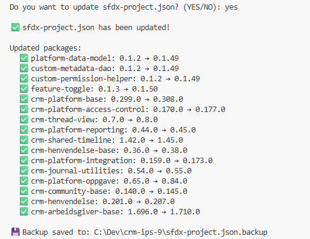
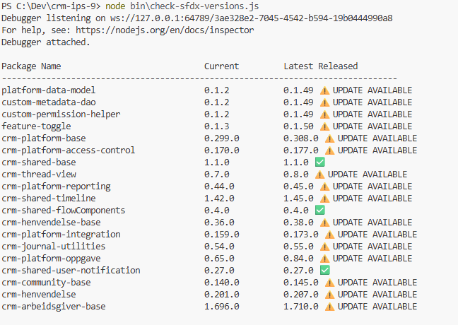

# 1.How to check versions in sfdx-project.json file against updated dependent packages

Windows system

- Open CMD(Command Prompt) or use terminal in visual studio code
- Go to your folder where you have your project
- Run node bin\check-sfdx-versions.js
- Update sfdx-project.json automatic by pressing YES
- Backup is saved to sfdx-project.json.backup



### Useful CMD(Command Prompt) commands

| Command         | Description                                         | Example                                                                                       |
| --------------- | --------------------------------------------------- | --------------------------------------------------------------------------------------------- |
| `cd..`          | Go **up** one folder level                          | If you are in `C:\Dev\crm-arbeidsforhold-9\bin`, you will go to `C:\Dev\crm-arbeidsforhold-9` |
| `cd foldername` | Go **into** a subfolder                             | `cd Dev` will take you from `C:\` to `C:\Dev`                                                 |
| `cd /d C:\path` | Go to a **specific folder** on any drive            | `cd /d C:\Dev\crm-arbeidsforhold-9`                                                           |
| `dir`           | **List** all files and folders in current directory | Shows files like `sfdx-project.json`, `package.json`, etc.                                    |

```cmd
C:\Users\YourName> cd /d C:\Dev\crm-arbeidsforhold-9
C:\Dev\crm-arbeidsforhold-9> node bin\check-sfdx-versions.js
```

It will list package name, current version, latest release.

